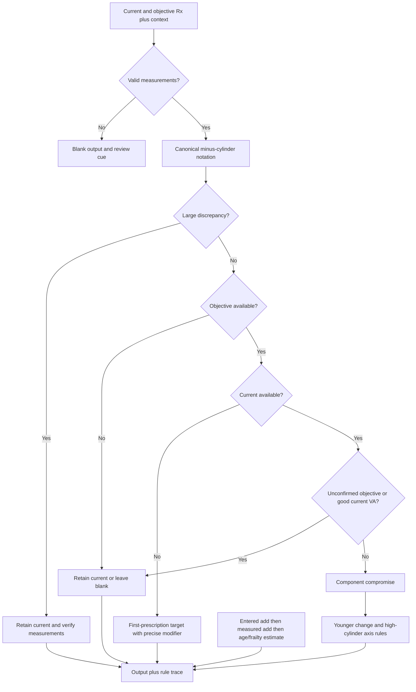

# Refract rule engine — 29 September 2026

## Purpose

Given the measurements and the available patient context, suggest what an experienced prescriber might reasonably consider. This is an explicit rule engine, not a neural network or a lookup of the author's 60 prescriptions. Suggestions remain provisional until accepted clinically.

## Result

Fixed sheet inputs, unchanged source:

| Measure                           | Previous | Revised |
| --------------------------------- | -------: | ------: |
| Exact complete prescriptions      |    24/60 |   29/60 |
| Exact RE                          |    39/60 |   44/60 |
| Exact LE                          |    33/60 |   40/60 |
| Exact add                         |    52/60 |   52/60 |
| Mean absolute sphere difference   |  0.106 D | 0.073 D |
| Mean absolute cylinder difference |  0.065 D | 0.042 D |

New complete matches: 21, 36, 40, 56 and 57. No previously exact complete match lost. Individual components can still worsen even when aggregate agreement improves. These cases informed development, so this is **in-sample agreement**, not independent predictive validation. The case-specific benchmark replay is not used by the app.

Spreadsheet: `outputs/refract-rules-20260929/Refract-logical-rules.xlsx`. It contains the ordered rule specification, thresholds, a live add calculator, original data and engine-output snapshots with formula-driven comparisons. It is not a second live prescription engine. Changes to spreadsheet parameter values do not deploy to the app.

## Ordered decisions

Full decision catalogue: `src/prescribing-rule-catalogue.js`. Runtime: `src/prescribing-rules.js`; retained component maths: `src/prescription-logic.js`; configuration: `src/prescription-config.js`.

The new explicit thresholds include age under 40, meaningful sphere gap 0.50 D, half-gap movement capped at 0.50 D or 0.25 D for sphere magnitudes at least 6 D and holding a retained cylinder's axis when cylinder magnitude is at least 1.75 D and axis gap is at most 5°. These are transparent development heuristics requiring author/clinical review, not claimed universal prescribing standards.

The conservative first-prescription seed reduces sphere **towards zero**, not always by subtracting 0.25 D. Flexible first-prescription cases use the objective target without that reduction. Unconfirmed first measurements remain explicitly provisional.

## Add policy

Retain a supplied current add, otherwise use supplied objective add, otherwise estimate from existing age bands. Health/frailty adds 0.25 D only to an age-derived estimate. Null and undefined no longer suppress estimation. Completed years remove gaps between integer age bands. This preserves existing entered-add precedence pending the author's clarification. Working distance, task demand and measured near response are not recorded and cannot be inferred from age.

## Source questions, not silent corrections

- Cases 19 and 22 use positive cylinder notation. The engine now handles equivalent notation consistently, but the source entries remain untouched.
- Case 14 has a given RE cylinder outside both recorded current and objective values. It may reflect unrecorded judgement or an entry error.
- Cases 14 and 47 change the supplied add; several older cases leave given add blank. The reasons are not recorded.
- Calm and repeat remain unused rather than being relabelled as tolerance or good VA without confirmation.
- Quality at least 8 maps to accurate per eye in the fixed benchmark. The live UI has a single accurate control, so the benchmark is not identical to what can be entered for mixed-quality eyes. A second quality UI control was not added in this pass.

## Engineering fixes

Simple mode projects to the rounded spherical equivalent. Repeated mode changes no longer accumulate half-cylinder offsets. Advanced values return unchanged unless that eye was edited in Simple mode; an edited Simple eye becomes a pure-sphere entry on returning to Advanced. Transpose is disabled in Simple mode to avoid altering hidden cylinders. Blank values do not trigger the low-power orange flag. A native disclosure explains the active rules and review cues identify invalid axes, children, uncertain measurements and large discrepancies.

## Verification

- Existing app/MCQ contracts pass.
- 960 modifier combinations plus all 60 cases for determinism, input immutability, RE/LE symmetry and transposition invariance pass.
- Fixed-input comparison and source CSV SHA-256 check pass.
- Bundle rebuilt from source; exact bundle parity passes.
- Isolated Edge HTTP and direct-file core calculation, four repeated mode-switch cycles, Simple edit handling and disclosure interaction pass at temporary 360 x 740. No horizontal overflow. HTTP console clean.
- Direct-file Edge blocks local fonts and the separate MCQ module through CORS; bundled calculation works. This is not a full direct-file acceptance claim.
- Workbook recalculation, numerical assertions, blank/zero add tests, formula-error scan and renders of every sheet pass in the artifact engine. Native Excel was not exercised.
- Retained Codex tab still identifies as Refract at the existing file URL. The hand-off script failed before making changes: the sandboxed attempt could not find the named desktop window and the elevated attempt could not find the Refract TabItem. Persistent toolbar sizing is not verified.
- Physical-device acceptance and independent clinical sign-off remain pending.

Evidence: `output/playwright/rules-20260929/report.json`, screenshots beside it and `tools/prescribing-baseline-20260929.json`.

Clinical framework references: [College of Optometrists, prescribing spectacles](https://www.college-optometrists.org/clinical-guidance/guidance/knowledge%2C-skills-and-performance/prescribing-spectacles) and [AAO Refractive Errors Preferred Practice Pattern](https://www.aaojournal.org/article/S0161-6420%2822%2900867-3/fulltext). They support individual clinical assessment, not the numerical heuristics authored here.
